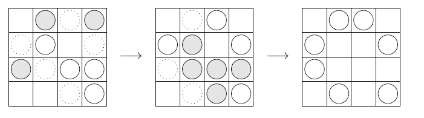

The goal of this project is to program an implementation of the Game of Life. This "game" consists of the evolution of a set of cells placed on a grid. Specifically, we have a finite grid made up of empty cells and cells occupied by a living cell. The state of the grid evolves in discrete time steps according to the following rules:

The state (empty or occupied by a cell) of each grid cell in the next step is determined by its current state and the number of currently occupied neighboring cells among its 8 adjacent neighbors:
- If an empty cell is adjacent to exactly three occupied cells, a cell will appear in that position in the next round.
- If a cell has one or fewer neighbors or four or more neighbors, the cell will disappear in the next round.
- All other cells retain their current state in the next round.



<figcaption style="text-align: center; font-weight: bold;">
Figure 1 – Two iterations of the Game of Life. Empty cells where a new cell will appear in the next round (cells with three neighbors) are indicated by dotted lines. Cells that will die (having fewer than two or more than three neighbors) are shaded.
</figcaption>

# Declaration of the class, initial methods, constructors, and accessors :
The variables $H$ and $W$ will correspond to the size of the considered grid (height and width). 

The variable `config`, which is a vector of vectors of booleans, will contain the arrangement of the cells on the grid. More specifically, the boolean `config[i][j]` will be `true` if the cell in the $i$-th row and $j$-th column is occupied, and will be `false` otherwise.

The method:
```cpp
int neighbors(int i, int j) const;
``` 
returns the number of occupied cells that are neighbors of the cell in the $i$-th row and $j$-th column.

The 'iteration' method performs a single iteration of the Game of Life. After calling this function, the 'config' variable is updated to reflect the arrangement of cells in the next time step.

### Display and streams :
The method:

```cpp
void display(std::ostream & stream) const;
```
allows writing the configuration to a stream in the following format:
```cpp
4 4
.X.X
.X..
 X.XX
...X
```
The first line displays the height and width of the grid. 

This example corresponds to the initial state shown in Figure 1.

To use this method, another constructor is needed that takes an input stream (`std::ifstream`) as an argument and creates a `jeu_vie` object from a file with the previous format.

The constructor should read the file as the previous format:

1. The first line contains the height and width of the grid.
2. The following lines describe the grid configuration using `.` for empty cells and `X` for occupied cells.

file : glider.dat is a configuration of cells that moves while maintaining the same shape (to be precise, it moves one cell down and to the right every 4 iterations).